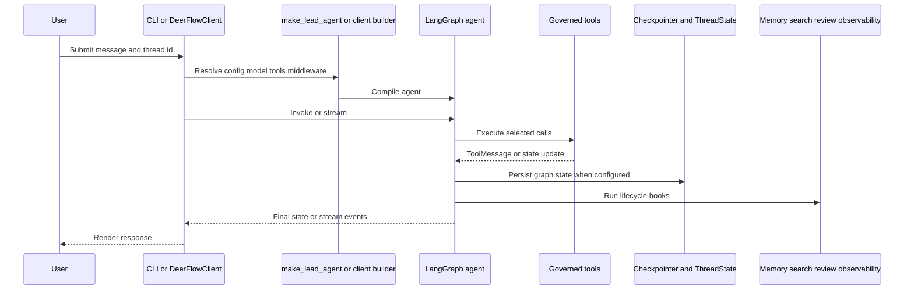

# Architecture Overview

Consult this page when a change crosses an entrypoint, agent construction, tool exposure, middleware, or persistence boundary. AgentFlow is a Python 3.12 workspace: the root application depends on the `backend` workspace package (`deerflow-harness`) and imports its modules by adding `backend` to `PYTHONPATH` or `sys.path`.

## Runtime Shape

The diagram shows the shared turn lifecycle; the CLI and embedded client differ in orchestration and output shape, not in the core agent abstractions.

`main.py:main` initializes logging, configuration, MCP tools, an async checkpointer, observability, and an interactive loop. It builds through `make_lead_agent`. `DeerFlowClient` is a synchronous programmatic surface that lazily creates an agent and exposes chat, stream, thread, configuration, and installation helpers. See [CLI workflows](../operations/cli-and-workflows.md) and [embedded client](../runtime/embedded-client.md).

The [lead agent](../runtime/lead-agent.md) resolves a model, builds prompts, asks the [tool registry](../tools/registry-and-governance.md) for the current callable surface, and composes [middleware](../runtime/middleware.md). `ThreadState` extends LangChain `AgentState` with thread paths, title, artifacts, todos, uploads, and prompt-cache fields. A configured [checkpointer](../runtime/checkpointing.md) persists this graph state; a thread ID alone does not provide multi-turn memory without a checkpointer.

## Persistence Boundaries

Three stores intentionally serve different purposes:

- Checkpoints preserve graph conversation state for resume.
- [Memory](../state/memory.md) stores compressed durable facts and summaries, globally or per agent.
- [Session search](../state/session-search.md) stores a searchable, deduplicated copy of user messages and final assistant replies.

[Observability](../state/observability.md) is another local data plane: it records execution facts, previews, token usage, failures, and summaries, not agent memory.

## Change Invariants

- Preserve middleware ordering when hooks depend on earlier state or error conversion; `ClarificationMiddleware` remains last in `_build_middlewares`.
- Keep tool registration and prompt disclosure synchronized. Deferred MCP schemas require both registry population and `DeferredToolFilterMiddleware`.
- Verify shipped surfaces, not only defining modules: a runtime API must resolve through the import path used by `main.py`, `backend/client.py`, or `backend/tools/__init__.py`.
- Background memory, search, review, and curator failures must not corrupt the foreground response. Their implementations either log failures, return structured failure results, or run off the foreground path.

The narrow architecture check is the smoke import suite. Add the focused domain suite for any stateful system touched; use the full `backend/tests` suite only for cross-system composition changes.
