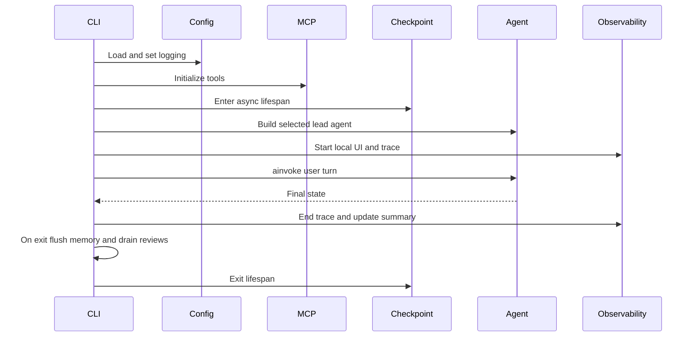

# CLI and Runtime Workflows

Run the local CLI with `python main.py`. `--continue` is the default and resumes the selected agent's mapped thread; `--new-session` rotates that mapping before agent construction.

The CLI adds `backend` to `sys.path`, loads MCP tools, enters `make_checkpointer`, subscribes to self-improvement events, and builds the lead agent with `ObservabilityMiddleware`. It persists last agent and per-agent thread mappings under the configured state root and creates per-agent memory on demand.

Before each prompt it compares the selected agent/runtime signature with current configuration and rebuilds when needed. Each normal turn starts an observability trace, invokes asynchronously with thread and agent context, renders the final message, and finalizes the trace. `/obs status|summary|full|off` changes capture behavior for the process; the local observability UI binds to `127.0.0.1:8081` when available.

Graceful exit ordering is significant: finalize thread summary, flush pending [memory](../state/memory.md), wait briefly for [background review](../skills/background-review.md), unsubscribe events, then leave the checkpointer context. Keyboard interrupt follows the same order. Turn exceptions end an active trace as failed and keep the loop available.

CLI behavior currently lacks a focused test module. For orchestration changes, extract or mock network/model/UI boundaries and test startup failure tolerance, config rebuild, new/continue mapping, trace completion on error, and all shutdown paths. The full core suite is the available regression command; manual live-model runs are conditional and should not be the primary proof.
