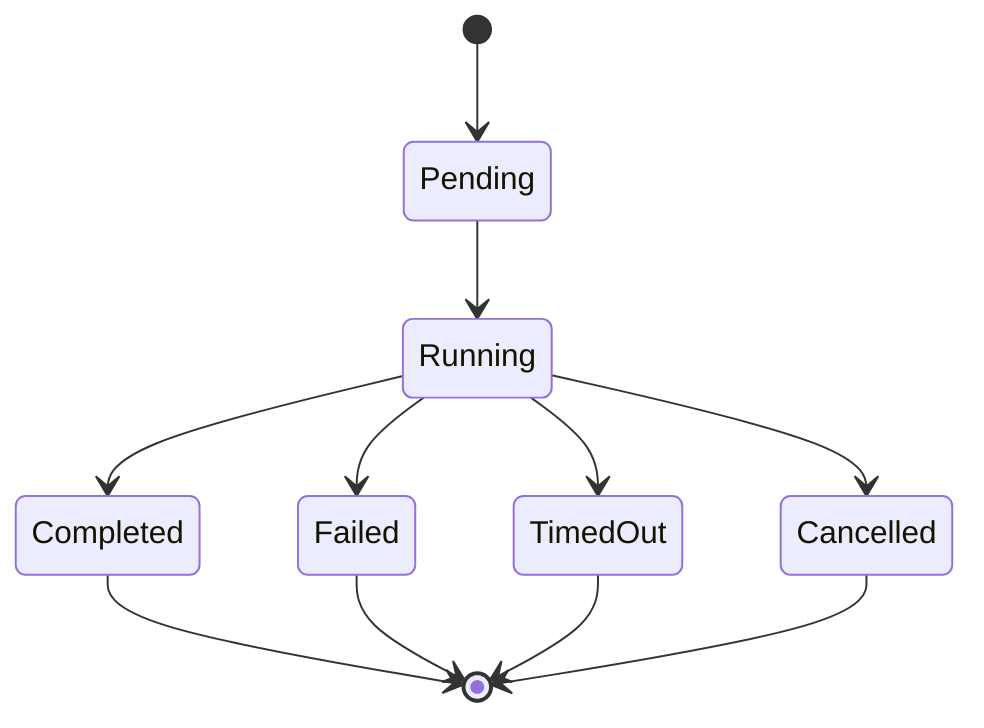

# Subagent Delegation

The `task` tool delegates a prompt to a built-in subagent in an isolated agent context. Registry aliases normalize coding names to `code`, apply global/per-agent timeout and max-turn overrides, and hide the `bash` subagent unless host bash is allowed. Built-in definitions live under `backend/subagents/builtins`.

This is the externally reported `SubagentStatus` lifecycle.

`task_tool` copies parent sandbox/thread data and trace metadata, obtains tools with subagent nesting disabled, then starts `SubagentExecutor.execute_async`. It polls backend result storage every five seconds and emits `task_started`, `task_running`, and a terminal custom stream event. Parent cancellation sets a cooperative cancel flag and schedules deferred cleanup; a long tool call can only observe cancellation at the next stream boundary.

`SubagentExecutor` filters tools by allowlist then denylist, inherits or overrides the parent model, compiles a separate agent with shared subagent runtime middleware, and carries selected thread data into initial state. Sync execution detects an existing event loop and moves work to an isolated thread/loop to avoid nested-loop conflicts. In-memory task results and thread pools are process-local.

When adding a subagent, update the built-in registry, aliases if required, config override lookup, prompt/tool policy, and task documentation. Validate registry exposure with `test_subagents_registry.py`; executor lifecycle changes need tests for all terminal transitions, timeout, cancellation before start and during streaming, result cleanup, independent task IDs, and running-loop isolation. Because current focused tests cover registry behavior more than executor concurrency, add executor tests for such changes.

Delegation consumes the [tool registry](../tools/registry-and-governance.md) but intentionally excludes recursive `task` exposure. Host command access remains governed by [security boundaries](../operations/security-and-boundaries.md).
