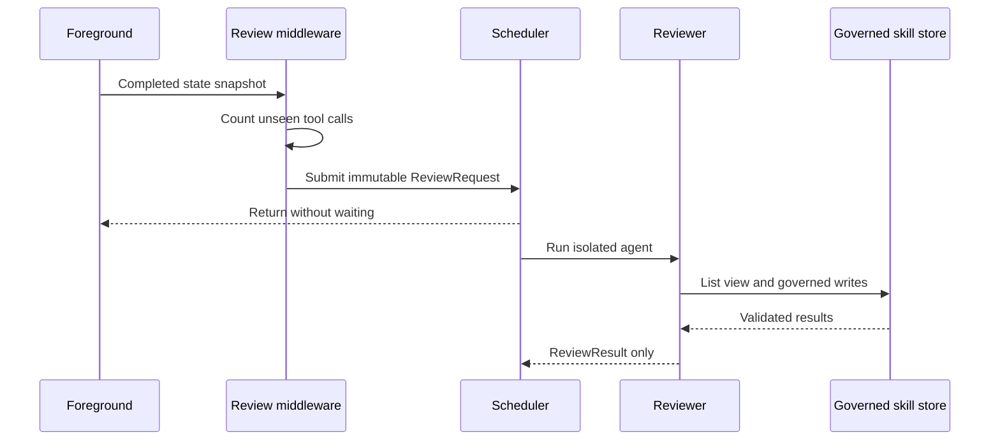

# Background Skill Review

Background review learns reusable workflows after enough foreground tool calls. `BackgroundReviewMiddleware` is only the trigger: its `after_agent` hook snapshots messages, updates per-thread counters, schedules work, and returns `None` immediately.

The foreground sees neither reviewer messages nor its internal state.

A `skill_manage` call in the foreground resets the nudge count. At threshold, one review per thread may run; global concurrency is bounded, and excess triggers are dropped rather than queued. Per-thread tool-call IDs are deduplicated and stale in-memory thread state is pruned.

`ReviewRequest` is frozen, carries a distinct `review_thread_id`, and contains plain transcript text rather than mutable message objects. The review agent has no checkpointer and only `skills_list`, `skill_view`, and a provenance-bound restricted `skill_manage`. Its sole middleware converts recoverable tool errors into `ToolMessage`s. `run_review` returns structured completed, timeout, or failed results and never intentionally raises. Writes completed before timeout remain valid and journalled.

The scheduler runs reviews in daemon threads with a bounded semaphore. CLI shutdown waits a bounded interval through `wait_for_idle`, linking this lifecycle to [CLI workflows](../operations/cli-and-workflows.md). Review events are visible through [observability](../state/observability.md).

Test threshold transitions, repeated snapshots, foreground skill reset, independent threads, one-review-per-thread, global saturation/drop, immutable request, tool isolation, provenance, timeout with partial writes, failure return, final-summary-only boundary, and shutdown wait. Use the two focused suites; skill policy changes also require [governed-write](governed-writes.md) tests.
