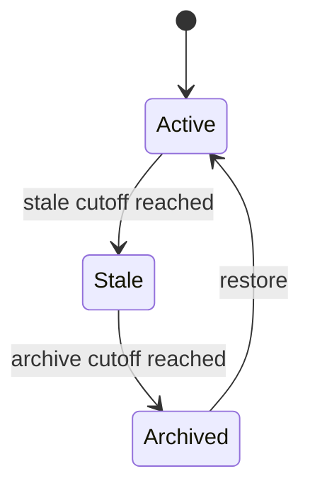

# Skill Curator Lifecycle

The curator maintains automated custom skills after inactivity and may consolidate overlapping skills. It operates only on curator-managed records; foreground-created and pinned skills are outside automatic transitions.

Automatic evaluation can move active to stale and then archived in one run when both cutoffs are already exceeded.

`archive_custom_skill` creates a compressed backup before moving the skill under `.archive`; backup failure aborts the move. Archive metadata records state, time, and path. `restore_archived_skill` resolves tracked or timestamped archives, rejects active-name conflicts unless forced, backs up an overwritten active skill, moves content back, marks it active, updates activity, and appends history.

`should_run_curator` requires feature enabled, not paused, enough idle time, and an elapsed interval. The first due check initializes `last_run_at` and does not run. `run_curator` applies deterministic transitions, optionally asks a model for consolidation actions, then records run count and summary. Consolidation actions call the same [governed write](governed-writes.md) implementation; archive is allowed only for curator-managed candidates.

## Behavioral Matrix

Cover active before cutoff, active-to-stale, stale-to-archive, both transitions in one pass, unchanged archived state, foreground-owned and pinned isolation, missing skill directory, backup success/failure, restore conflict/force/timestamp fallback, schedule initialization/idle/paused/interval cases, and consolidation action limits. Run `test_curator_lifecycle.py` and `test_curator_middleware.py`; include skill-manage tests when action wiring changes.
