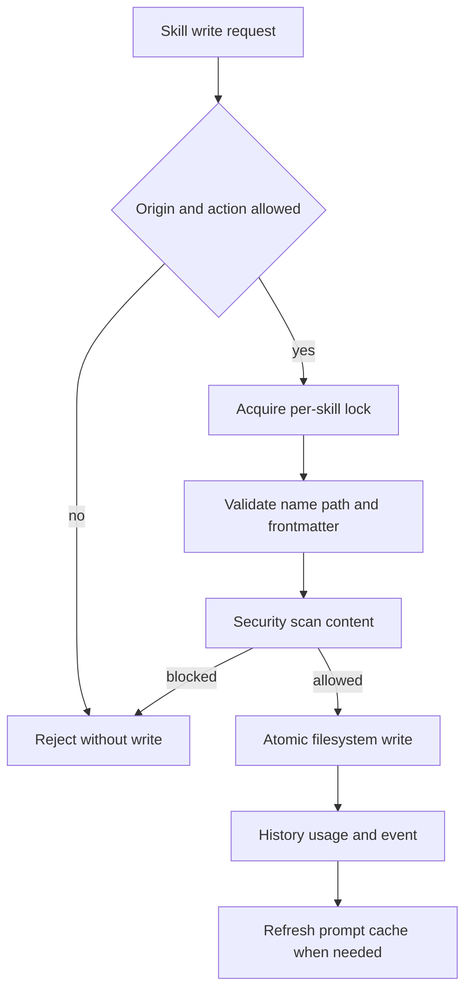

# Governed Skill Writes

`skill_manage` is the only model-facing write surface for custom skills. Its implementation supports create, edit, patch, support-file write/remove, archive, and restore; direct whole-skill deletion is suspended. The [background reviewer](background-review.md) receives a restricted wrapper whose schema excludes destructive actions.

The diagram shows the write path; the content write is authoritative even if later bookkeeping fails.

`_enforce_write_policy` validates provenance. Foreground users may edit custom skills subject to action rules. Background review, curator, and migration are automated origins: they may not perform destructive actions, touch pinned skills, or modify skills not marked curator-managed. A non-foreground execution context must declare background provenance when policy requires it.

`skill.manager` validates lowercase names, exact frontmatter name, editable category, and support paths constrained to `references`, `templates`, `scripts`, or `assets`. Markdown and executable support files are security-scanned; executable content requires an explicit allow decision. Writes use temporary files plus replace and serialize per skill. Successful writes append history, update provenance/usage, emit an event, and refresh the skill prompt cache for main-file/archive/restore changes.

## Change Recipe and Matrix

For a new action, update the foreground schema, background schema if permitted, policy sets, implementation, scanner classification, history/usage/event records, prompt-cache behavior, and curator callers. Test unknown origin, foreground/background context mismatch, user-owned and curator-managed skills, pinned state, public skill collision, invalid names/paths/frontmatter, scanner block, concurrent same-skill writes, bookkeeping failure after a successful write, and archive/restore interaction. Run both focused suites; curator actions additionally require `test_curator_lifecycle.py`.
