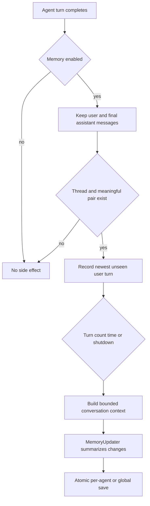

# Durable Memory

Memory stores compact facts and summaries that should remain true, not raw conversation history. For exact past turns use [session search](session-search.md); for resumable graph state use [checkpointing](../runtime/checkpointing.md).

The diagram shows the after-agent path from filtering to durable storage.

`MemoryMiddleware.after_agent` removes tool messages, intermediate AI tool calls, and ephemeral `<uploaded_files>` blocks. It detects recent explicit correction and reinforcement signals, with correction taking precedence, then calls `MemoryUpdateQueue.record_turn`.

The queue keeps independent cursors and pending tails per thread. It queues on `update_every_turns`, a time trigger, or `flush`; a global debounce batches update work. Only the newest unseen user turn is appended from repeated state snapshots. CLI shutdown calls `flush` because daemon timers would otherwise lose pending updates.

`FileMemoryStorage` selects per-agent `memory.json` when an agent name is present and global storage otherwise. It validates agent names, caches by modification time, migrates non-1.1 data through deterministic compression, optionally backs up migration input, and writes through a temporary file plus replace. Compression removes procedural/tool traces, deduplicates facts, ranks by confidence/time, and caps count.

## Behavioral Matrix

Test disabled and enabled state, no thread/messages, upload-only versus upload-plus-question, tool-call filtering, correction versus reinforcement, unchanged repeated snapshots, independent thread cursors, interval/time/flush triggers, per-agent isolation, migration backup, and failed atomic save. Existing `test_memory_middleware.py` covers filtering, signals, and basic hook guards; queue/storage changes need focused additions.
