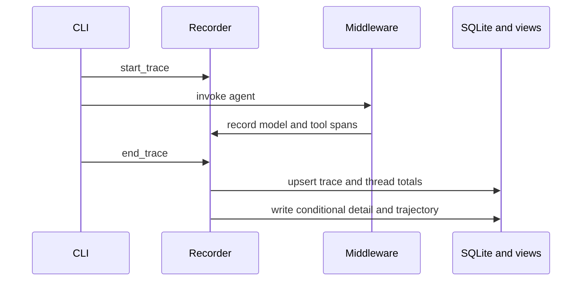

# Local Observability

Observability records how a turn executed; it is not memory or session recall. The CLI starts a trace before `agent.ainvoke`, injects `ObservabilityMiddleware`, and ends the trace with success or failure. A `ContextVar` associates model and tool hooks with the current `TraceContext`.

The diagram shows capture ownership around a foreground turn.

`ObservabilityMiddleware` measures sync and async model/tool calls. It normalizes usage, including cache hit/miss and conservative billable input, and records non-OK tool messages as failures without changing handler semantics. Exceptions are recorded and re-raised.

`ObservabilityRecorder` sanitizes previews according to `summary`, `full`, or `off`, computes failure/recovery and anomaly diagnostics, stores normalized records, updates thread totals, and writes summary views. Detailed trace files are conditional on full mode, failure, or configured anomaly thresholds. Trajectory export and legacy session-log bootstrap are optional recorder behaviors.

`ObservabilityStore` owns `observability.db` tables for traces, spans, model calls, tool calls, cache events, thread totals, exports, legacy imports, and background events. Skill/memory/review events use the background-event surface, connecting observability to [self-improvement workflows](../skills/background-review.md).

When adding captured content, route it through redaction and content-mode checks. Test secrets, truncation, mode transitions, successful and failed tool-result semantics, recovery classification, totals, conditional files, and background filters. The focused command is `PYTHONPATH=backend python -m pytest backend/tests/test_observability_core.py -q`; web UI checks are conditional on changing `backend/observability/web/app.py`.
