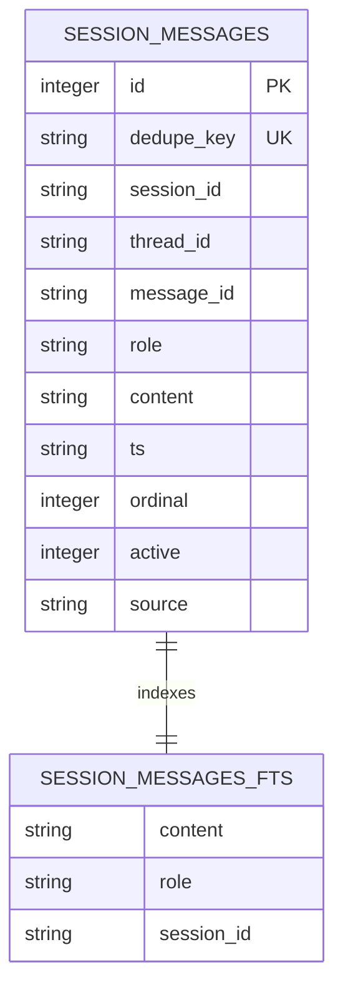

# Session Search

Session search is a searchable copy of completed conversation turns. It does not resume a graph or decide durable truth; those belong to [checkpointing](../runtime/checkpointing.md) and [memory](memory.md).

The diagram shows the content table and its external-content FTS5 index.

`SessionSearchMiddleware.after_agent` indexes in a daemon thread by default, or inline when requested. It reads the thread ID from runtime context or configurable metadata and optionally auto-prunes. Indexing keeps user messages and final assistant responses, strips upload metadata, skips AI tool calls, truncates returned content, and generates a stable dedupe key from message ID or ordinal/content hash.

Search tokenizes words and CJK characters, executes an OR FTS query ranked by BM25 and recency, and falls back to `LIKE` for CJK queries with no FTS result. Public modes include search, recent-session browse, full session head/tail, around-message windows, soft delete, retention prune, and vacuum. The `session_search` tool selects these modes through `search_sessions`.

When changing schema, keep content-table and FTS writes synchronized and account for existing databases in `ensure_schema`. Test insert/dedupe, filtered messages, CJK fallback, empty query, head/tail omission, around-window bounds, deactivation, pruning, and tool JSON shape. `PYTHONPATH=backend python -m pytest backend/tests/test_session_search_core.py -q` is the focused check; no live model is needed.
