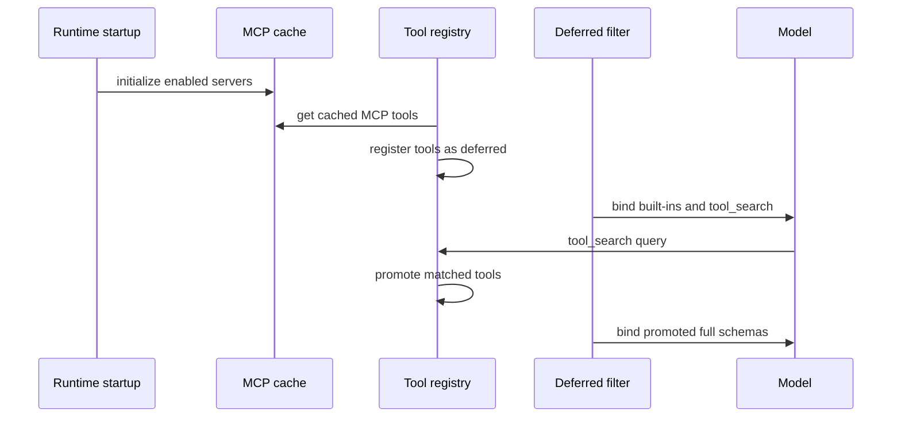

# MCP and Extension Tools

`ExtensionsConfig` loads optional MCP server definitions and skill-enabled state from a private JSON file. Supported server configuration describes `stdio`, `sse`, or `http` transports and optional OAuth for network transports. Environment placeholders are resolved before clients are built; keep actual credentials outside source control.

The CLI calls `initialize_mcp_tools` at startup. `get_cached_mcp_tools` also supports lazy initialization for other runtimes and invalidates the process cache when the extension file's modification time advances. If called while an event loop is running, lazy initialization executes in a separate thread/loop.

The diagram shows deferred discovery when `tool_search.enabled` is true.

`DeferredToolRegistry` is stored in a `ContextVar`, so concurrent async runs do not intentionally share promotion state. It supports exact `select:`, required-name `+keyword`, and regex search forms, returns at most five schemas, and removes matched names from the deferred set. The [middleware chain](../runtime/middleware.md) must include `DeferredToolFilterMiddleware`; registry setup alone does not hide schemas.

## Change Surface

An MCP change can cross extension parsing, transport/client construction, cache initialization/reset, registry assembly, deferred filtering, and the model-facing `tool_search` schema. Validate both startup and lazy paths, stale-file reset, independent request contexts, invalid regex fallback, result limits, and promotion. The current core suite has no dedicated MCP cache/registry tests; add focused tests for behavior changes. Live-server integration is conditional on changing transport/OAuth behavior and should use a controlled test server, not real credentials.
